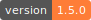
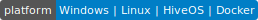
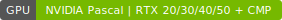
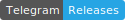
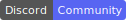

<p align="center">
  
</p>

<h1 align="center">ForgeMiner</h1>

<p align="center"><b>Быстрый нативный NVIDIA GPU-майнер — Pearl (PRL), QubitCoin (QTC), KawPow (Ravencoin, Quai, Neurai), Cryptix (CYTX), BTX (btx.dev) и Xelis (XEL)</b></p>

<p align="center">
  <a href="https://github.com/0xHashRaptor/ForgeMiner/releases"></a>
  <a href="#загрузка"></a>
  <a href="#поддерживаемые-карты"></a>
</p>
<p align="center">
  <a href="https://forgeminer.org"></a>
  <a href="https://t.me/ForgeMiner"></a>
  <a href="https://discord.gg/vxUTbb9B"></a>
</p>

---

## Оглавление

- [Обзор](#обзор)
- [Загрузка](#загрузка)
- [Быстрый старт](#быстрый-старт)
- [Монеты и комиссия](#монеты-и-комиссия)
- [Производительность](#производительность)
- [Возможности](#возможности)
- [Опции](#опции)
- [API мониторинга](#api-мониторинга)
- [Поддерживаемые карты](#поддерживаемые-карты)
- [Ресурсы](#ресурсы)

---

## Обзор

ForgeMiner — высокопроизводительный, полностью нативный NVIDIA GPU-майнер. Он работает с картой напрямую через CUDA Driver API — без Python, WSL и лишних рантаймов — поэтому стартует мгновенно и легко идёт даже на слабых ригах. Майнит **Pearl (PRL)**, **QubitCoin (QTC)**, **KawPow** (Ravencoin RVN, Quai QUAI, Neurai XNA), **Cryptix (CYTX)**, **BTX (btx.dev)** и **Xelis (XEL)** из одного бинарника — монета выбирается одним флагом — и новые монеты в разработке.

Под каждый алгоритм для каждой карты идёт отдельная сборка под её архитектуру, которая выбирается автоматически при запуске — так каждая GPU работает на пике.

Сайт: **[forgeminer.org](https://forgeminer.org)** · ForgeMiner — closed-source; релизы публикуются здесь и анонсируются в [Telegram](https://t.me/ForgeMiner) и [Discord](https://discord.gg/vxUTbb9B).

<!-- Совет: вставьте сюда скриншот дашборда — это сразу повышает доверие, напр. -->
<!-- <p align="center"></p> -->

---

## Загрузка

Последняя сборка — на странице [**Releases**](https://github.com/0xHashRaptor/ForgeMiner/releases):

| Платформа | Пакет |
|---|---|
| Windows | `ForgeMiner-<версия>-windows.zip` |
| Linux | `ForgeMiner-<версия>-linux.tar.gz` (glibc 2.17+) |
| HiveOS | `ForgeMiner-<версия>.tar.gz` (install URL для флайт-шита) |
| Docker | `docker pull hashraptor/forge` (теги `:latest` и версия) |

---

## Быстрый старт

### Windows
1. Скачайте и распакуйте Windows-релиз.
2. Откройте `.bat` под свою монету/пул/регион и впишите кошелёк и воркер. Файлы называются `<algo>_<pool>_<region>.bat` (`_SSL` = шифрование). По одному на монету:
   - Pearl — `pearlhash_Baikal_Global.bat`, `pearlhash_Kryptex_RU.bat`, …
   - QubitCoin — `qhash_LuckyPool_RU.bat`, `qhash_k1pool_EU.bat`, …
   - KawPow — `kawpow_RVN_HeroMiners_US.bat`, `kawpow_QUAI_Kryptex_EU.bat`, `kawpow_XNA_2Miners_EU.bat`, …
   - Cryptix — `cryptix_Baikalmine_Global.bat`
   - BTX — `btx_lproute_EU.bat`, `btx_lproute_RU.bat`
   - Xelis — `xelis_XEL_HeroMiners_DE.bat`, `xelis_XEL_Kryptex_Global.bat`, …
3. Двойной клик — запуск. Для встроенного разгона — «Запуск от имени администратора».

### Linux
```bash
chmod +x forge
# Pearl
FORGE_POOL=ru.pearl.herominers.com:1200 FORGE_WALLET=YOUR_PRL_WALLET FORGE_WORKER=rig01 ./forge
# QubitCoin
./forge --algorithm qhash  --wallet YOUR_QTC_WALLET  --pool ru.luckypool.io:8610          --worker rig01
# KawPow — RVN / QUAI (монета определяется по пулу) или XNA (задать --coin xna)
./forge --algorithm kawpow --wallet YOUR_RVN_WALLET  --pool us.ravencoin.herominers.com:1140 --worker rig01
# Cryptix
./forge --algorithm cryptix --wallet YOUR_CYTX_WALLET --pool cytx.baikalmine.com:9010        --worker rig01
# BTX
./forge --algorithm btx     --wallet YOUR_BTX_WALLET  --pool btx-eu.lproute.com:8660          --worker rig01
# Xelis
./forge --algorithm xelis   --wallet YOUR_XEL_WALLET  --pool de.xelis.herominers.com:1225      --worker rig01
```

### Docker
```bash
docker pull hashraptor/forge
docker run --rm --gpus all hashraptor/forge \
  --algorithm pearlhash --wallet YOUR_PRL_WALLET --worker rig01 --pool pearl.baikalmine.com:2010
# дашборд: добавьте -p 7777:7777 и --api-bind 0.0.0.0:7777
```

### HiveOS
Custom miner — installation URL `.../ForgeMiner-<версия>.tar.gz`, шаблон кошелька `%WAL%.%WORKER_NAME%`, а в *Extra config* задайте `FORGE_ALGO=pearlhash` (или `qhash` / `kawpow` / `cryptix` / `btx` / `xelis`; для KawPow ещё `FORGE_COIN=rvn|quai|xna`). Готовые флайт-шиты: **[forgeminer.org/#flightsheets](https://forgeminer.org/#flightsheets)**.

---

## Монеты и комиссия

| Монета | `--algorithm` | Пулы (готовые `.bat` в релизе) | Комиссия |
|--------|---------------|--------------------------------|:------:|
| Pearl (PRL) | `pearlhash` | BaikalMine · HeroMiners · LuckyPool · Kryptex · 2Miners · AlphaPool | 2% |
| Cryptix (CYTX) | `cryptix` | BaikalMine · CryptixNetwork | 2% |
| QubitCoin (QTC) | `qhash` | LuckyPool · k1pool | 1% |
| BTX (btx.dev) | `btx` | LuckyPool (lproute) | 1% |
| Xelis (XEL) | `xelis` | HeroMiners · Kryptex | 1% |
| Ravencoin (RVN) | `kawpow` | HeroMiners · 2Miners · RavenMiner · Kryptex · k1pool | 0.7% |
| Quai (QUAI) | `kawpow` `--coin quai` | HeroMiners · k1pool · Kryptex | 0.7% |
| Neurai (XNA) | `kawpow` `--coin xna` | 2Miners · Vipor · Kryptex | 0.7% |

Комиссия чередуется в потоке (без провалов на графике) и проверяется на пуле. Скрытой второй комиссии нет. *Больше алгоритмов в разработке.*

---

## Производительность

Хешрейт Pearl на карту — **проверено сообществом, зависит от разгона и лимита мощности**:

| GPU | Pearl (PearlHash) |
|-----|:-----------------:|
| RTX 5080 | ~195 TH/s |
| RTX 4070 Ti | ~122 TH/s |
| RTX 3060 Ti | ~58 TH/s |
| P104-100 (8 ГБ) | ~6.5 TH/s |

KawPow на P104-100 — около **11.5 MH/s** на карту. Присылайте свои цифры в [Telegram](https://t.me/ForgeMinerChat) или [Discord](https://discord.gg/vxUTbb9B) — таблица растёт вместе с сообществом.

---

## Возможности

- **Много монет, один бинарь** — Pearl, QubitCoin, KawPow (RVN / QUAI / XNA), Cryptix, BTX или Xelis; выбор через `--algorithm`.
- **Ядра под архитектуру** — отдельное ядро под каждое поколение (Pascal / Volta / Turing / Ampere / Ada / Blackwell), выбирается при старте.
- **Нативно и легко** — напрямую через CUDA Driver API, почти нулевая нагрузка на CPU; без Python, WSL и рантаймов. Стартует за секунду, идёт на слабых хостах и многокарточных ригах.
- **Эффективно на забитых ригах** — держит карты загруженными даже при слабом CPU, нескольких инстансах или медленных x1-райзерах.
- **Один самодостаточный бинарь** — всё внутри; без CUDA runtime и разбросанных файлов ядер. Даже KawPow — один исполняемый файл.
- **Встроенный разгон и кулеры** — фикс частот, оффсеты, лимит мощности и управление кулерами прямо из майнера — свой разгон на каждую карту. Без сторонних утилит.
- **Multi-pool с failover** — обычный Stratum для всех монет, SSL/TLS-пулы, авто-переподключение и failover.
- **Живой дашборд и read-only API** — хешрейт по картам, температуры (в т.ч. VRAM на Windows), частоты, кулеры, мощность и шары — плюс JSON, Prometheus и Claymore-совместимые эндпоинты.
- **Готов к HiveOS** — вставляется в слот кастомного майнера.

---

## Опции

У любого флага командной строки есть двойник-переменная `FORGE_*` — удобно для *Extra config* в HiveOS и `.bat`.

| Флаг | Env | Описание |
|------|-----|----------|
| `--algorithm` | `FORGE_ALGO` | `pearlhash`, `qhash`, `kawpow`, `cryptix`, `btx` или `xelis`. |
| `--coin` | `FORGE_COIN` | Монета KawPow: `rvn`, `quai` или `xna` (определяется по пулу; для Neurai / Vipor задавать явно). |
| `--pool` | `FORGE_POOL` | Пул `host:port`. SSL/TLS поддерживается; несколько адресов для failover. |
| `--wallet` | `FORGE_WALLET` | Адрес кошелька для выплат. |
| `--worker` | `FORGE_WORKER` | Имя воркера/рига. |
| `--password` | `FORGE_PASS` | Пароль пула (обычно `x`). |
| `--proto` | `FORGE_PROTO` | Диалект Pearl: `stratum` или `alpha` (AlphaPool). |
| `--gpu` | `FORGE_GPU` | Майнить только эти индексы, напр. `0,1,2,6` (порядок `nvidia-smi`). |
| — | `FORGE_LOWVRAM` | Режим low-VRAM для 8 ГБ карт (Pearl). По умолчанию авто. |

<details>
<summary><b>Разгон и управление кулерами</b></summary>

> ForgeMiner упирается в частоту ядра и нетребователен к памяти — поднимайте ядро, память можно оставить низкой. Разгон требует root (Linux/HiveOS) или Администратора (Windows). Каждый флаг принимает одно значение или список через запятую под `--gpu`.

| Флаг | Env | Описание |
|------|-----|----------|
| `--cclk` | `FORGE_CCLK` | Зафиксировать частоту ядра (МГц). |
| `--coff` | `FORGE_COFF` | Оффсет ядра (МГц, +/−). |
| `--mclk` | `FORGE_MCLK` | Зафиксировать частоту памяти (МГц). |
| `--moff` | `FORGE_MOFF` | Оффсет памяти (МГц, +/−). |
| `--plimit` | `FORGE_PLIMIT` | Лимит мощности (Вт). |
| `--fan` | `FORGE_FAN` | Фиксированная скорость кулера (%). |
| `--fan-curve` | `FORGE_FANCURVE` | Кривая температура→скорость, напр. `45:30,60:55,70:75,80:100`. |

```text
# по-картово (значения по порядку --gpu)
--gpu 0,1,2,6 --coff 300,250,300,200 --plimit 280,280,300,260
```
У GeForce есть аппаратный порог кулера ~30%; при выходе возвращается авто-режим драйвера.
</details>

---

## API мониторинга

Выключен по умолчанию и **только для чтения** — отдаёт статистику, управлять майнером через него нельзя.

```text
--api                    на 127.0.0.1:7777 (только эта машина)
--api-bind 0.0.0.0:7777  в локальной сети (смотреть с телефона / другого ПК)
```
На HiveOS задайте `FORGE_API=127.0.0.1:7777` в *Extra config*.

| Эндпоинт | Формат | Для чего |
|---|---|---|
| `GET /` | HTML | Веб-дашборд (общий и по-картовый хешрейт, температуры, VRAM, частоты, кулеры, мощность, шары, живой график; тёмная/светлая тема). |
| `GET /summary` | JSON | Grafana, боты, свои дашборды. |
| `GET /metrics` | Prometheus | Дашборды и алерты Grafana. |
| `miner_getstat1` | Claymore | Awesome Miner, mmpOS и остальная экосистема мониторинга. |

> Оставляйте `127.0.0.1` для локального доступа; `0.0.0.0` — только за своим роутером / файрволом / VPN.

---

## Поддерживаемые карты

Ядра затюнены под архитектуру, поэтому поддерживается всё поколение целиком — десктопные и ноутбучные.

| Поколение | Карты |
|---|---|
| **Blackwell** (RTX 50) | 5090 · 5080 · 5070 Ti · 5070 · 5060 Ti · 5060 · 50-й серии Laptop |
| **Ada** (RTX 40) | 4090 · 4080 (S) · 4070 Ti (S) · 4070 (S) · 4060 Ti · 4060 · 40-й серии Laptop |
| **Ampere** (RTX 30) | 3090 Ti · 3090 · 3080 Ti · 3080 · 3070 Ti · 3070 · 3060 Ti · 3060 · 30-й серии Laptop |
| **Turing** (RTX 20) | 2080 Ti · 2080 (S) · 2070 (S) · 2060 (S) · 20-й серии Laptop *(драйвер 545+)* |
| **Volta** | Tesla V100 |
| **Pascal** | GTX 10-й серии · P104-100 · P106 · P108 (8 ГБ майнинг-карты) |
| **CMP** | 90HX · 50HX · 40HX · 30HX *(драйвер 545+)* |

*Все монеты работают на каждом из перечисленных поколений.*

---

## Ресурсы

- **Сайт:** [forgeminer.org](https://forgeminer.org)
- **Релизы и новости:** [t.me/ForgeMiner](https://t.me/ForgeMiner)
- **Поддержка и чат:** [t.me/ForgeMinerChat](https://t.me/ForgeMinerChat)
- **Discord:** [discord.gg/vxUTbb9B](https://discord.gg/vxUTbb9B)

---

<p align="center"><sub>© 2026 ForgeMiner. Не связан с NVIDIA. Майньте ответственно.</sub></p>
